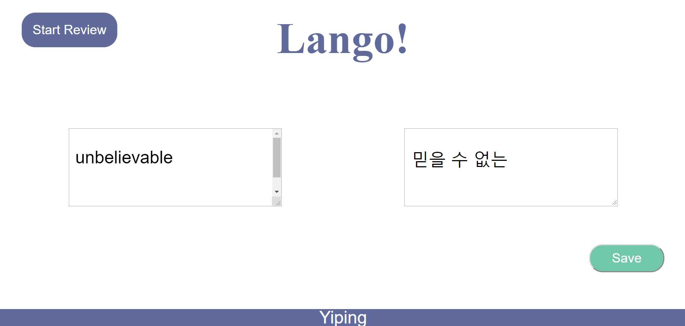
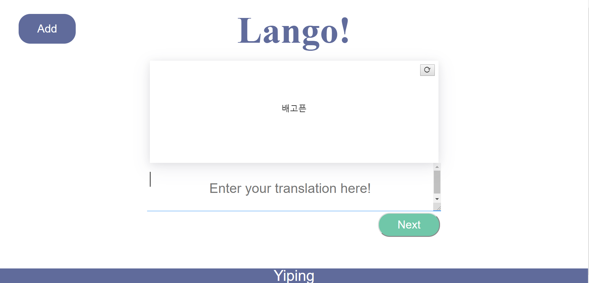
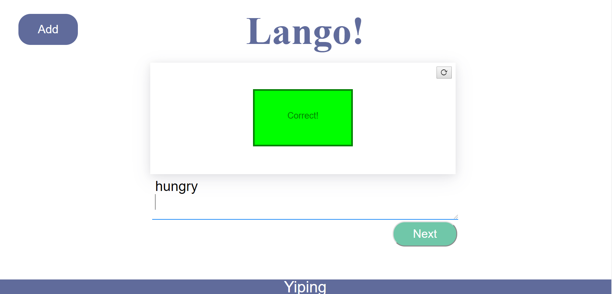

# ECS 162: LANGO! Project #

## What is Lango? ##
Lango is a flashcard review web app with the following features:
* User login/authentication functionality
* Review functionality
* Create/save functionality
- - - -
The website design was created by the class designer, Jamie. We implemented the design through Facebook's
React library, CSS, and minimal HTML.
> Please email me if you have any other questions or concerns!

## Usage Directions ##
### Installation ###
Lango uses the following node packages:
* express
* sqlite3
* cookie-session
* passport
* babel-cli@6 babel-preset-react-app@3
* passport-google-oauth20
* request 

### API ### 
Lango uses Google Cloud API to provide authentication and translation. The app requires an API key to run, which can be found here: [Google Cloud](https://cloud.google.com/ "Google Cloud Link")

### Launching the Server ###
From your main Flashcards directory, find server.js and use the following command: \
`node server.js`
> Note: Replace the API key constant located in server.js before launching the App

### Accessing the Website ###
The main landing page is located in the `public` directory. \
An example url to access the main page: \
`http://server_siteName:[portNumber]/login.html`
> `server.js` uses the port number in its code - which needs to be changed (initialized to an empty string)

## Website Demo ##

#### Create Flashcards Page ####

#### Review Flashcards Page ####

#### Reviewing - Correct Indicator ####

## License ##
> This project was created as an assignment for ECS 162 at UC Davis (Spring 2019) and is released for showcase purposes.
> I do not own any rights to the designs, so please do not copy them! Thanks!

## Contributors ##
Yiping (Allison) \
Lavanya

